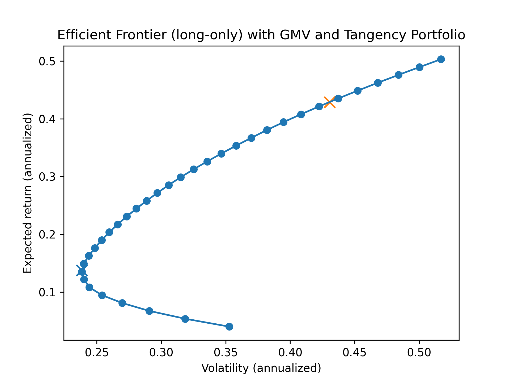

# Strategic Asset Allocation: CAPM Alpha & Mean-Variance Optimization

**Author:** Mario Innocente | MIM Candidate, INSEAD  
**Focus:** Portfolio Management, Quantitative Analysis, Python

---
[📄 **Download Full Research Report (PDF)**](../../reports/CAPM2.pdf)
## 🚀 Executive Summary
This project implements a quantitative framework for constructing an optimal equity portfolio within the US Tech sector. By combining **Factor Analysis (CAPM)** with **Modern Portfolio Theory (Markowitz)**, the model identifies the optimal trade-off between risk and return.

The engine processes historical data for large-cap tech stocks (`AAPL`, `MSFT`, `NVDA`, `AMZN`, `GOOGL`) against the market benchmark (`SPY`) to generate:
1.  **Alpha/Beta Decomposition:** Isolating idiosyncratic skill from systematic risk.
2.  **Efficient Frontier:** Mapping the optimal risk/return set.
3.  **Tangency Portfolio:** Maximizing the Sharpe Ratio.
4.  **Global Minimum Variance (GMV):** Minimizing volatility constraints.

---

## 📊 Key Visualizations
*(Note: Run the notebook to generate the interactive plots)*

The model constructs the **Efficient Frontier**, identifying two critical portfolios:
* **The GMV (Blue X):** The lowest risk mathematically achievable.
* **The Tangency Portfolio (Gold X):** The portfolio with the highest risk-adjusted return (Max Sharpe).

> 

---

## 🛠 Methodology

### 1. Factor Decomposition (CAPM)
Before optimization, we analyze the return drivers using OLS regression on excess returns:
$$R_{i} - R_f = \alpha_i + \beta_i (R_{m} - R_f) + \varepsilon_{i}$$

* **$\beta$ (Beta):** Measures systematic risk exposure.
* **$\alpha$ (Alpha):** Measures value added beyond market movements.

### 2. Mean-Variance Optimization
We solve the quadratic optimization problem to minimize portfolio variance for a target return, subject to **Long-Only** constraints ($w_i \ge 0$):

$$\min_{w} w^T \Sigma w$$

Where $\Sigma$ is the covariance matrix of asset returns. The optimizer utilizes the **SLSQP** algorithm from `scipy.optimize`.

---
